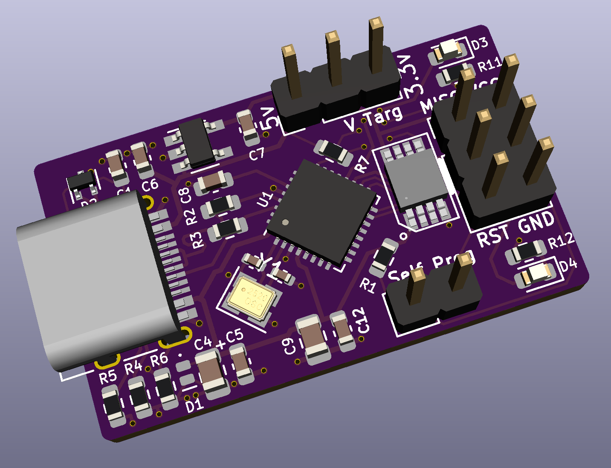

# **LUFA AVRISP-MKII**

**Custom PCB designed for the LUFA AVRISP-MKII Project https://github.com/abcminiuser/lufa**

This repo contains the PCB and firmware configuration files for a compact USB-C programming board designed for LUFA's AVRISP-MKII firmware based on an ATMega16u2.  Major thanks to the LUFA project for making this possible!

## About
---
This PCB is designed only for ISP. However, the PCB could be expanded to break out the PDI and TPI pins as well! It has a level shifter that allows programming of targets other than 5V. Adding a 2-pin jumper to `V Targ` allows the target device to be powered from this board as well. 2 voltages are available - 5v and 3.3v. If you wish to program the 16u2 from the ISP header, the RST pin must be shorted to the 16u2's RST pin, this can be done with a jumper on the `Self Prog` pin header.
## File Structure
---
- `Firmware`
    - Contains configuration files for the LUFA AVRISP-MKII project.
- `KiCad`
    - Contains the KiCad files for the PCB.
- `images`
    - Contains images of the PCB and schematic.

## Firmware Setup and Programming
---
### Setup
1. Clone the repository from https://github.com/abcminiuser/lufa.
1. From this repo's `Firmware` folder, copy and replace the `Config` folder and `makefile` into `Projects/AVRISP-MKII/` in the LUFA repo.
1. From this repo's `Firmware` folder, copy `BHATASAKA` folder into`LUFA/Divers/Board/AVR8` in the LUFA repo.
1. In the LUFA repo, modify `LUFA/Drivers/Board/Board.h` and copy the last `#elif`, then modify it to use `BHATASAKA` as the board name

### Compiling
Go to `Projects/AVRISP-MKII/` and type `make`. Make sure Make and avr-gcc are installed and in your path.

### Programming
1. The hex file generated in the `Projects/AVRISP-MKII/` folder can be flashed through DFU. Plug the board into your computer. If it is blank it will show up as ATMega 16u2. If it doesn't, reset the chip after it's plugged in.
1. Download Zadig (https://zadig.akeo.ie/) and Atmel Flip (https://www.microchip.com/en-us/development-tool/flip) - make sure you Java SE JRE installed and in your path. Install Flip.
1. Open Zadig and select the 16u2. Install the `libusb-win32` driver for the chip.
1. Open Atmel Flip, select the 16u2, connect to it, load the hex file, and program the chip. It should now show up as an AVRISP-MKII (may need to unplug and replug).

## Usage
---
Install AVRISP-MKII drivers with Zadig (https://zadig.akeo.ie/). Choose `libusb-win32`.
To use with Arduino, select the `AVRISP mkii` programmer. To use with AVRDude, use `-c avrispmkII`.

---
Major thanks to LUFA, KiCad, and Zadig!